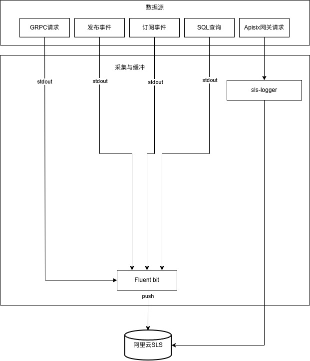
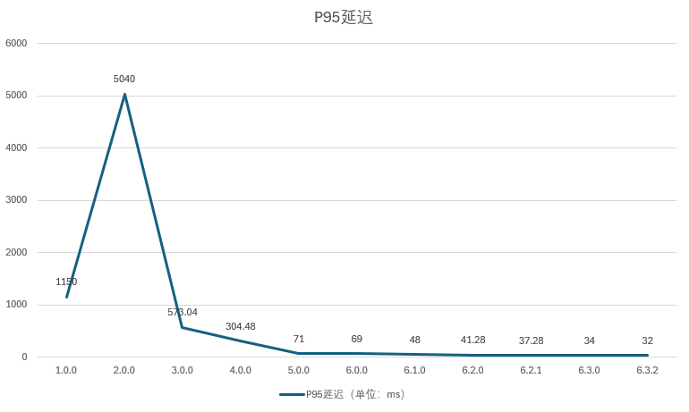
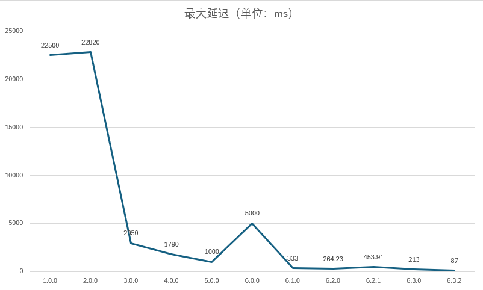

# Golang微服务架构演进实践

## 声明
- 请勿未经允许使用Releases的产物及源码用于商业用途，若需合作请发送邮件到zhanshen02154@gmail.com联系作者本人。
- 严禁将代码及产物（含附属品）用于非法活动如赌博、诈骗、洗钱等，一经发现将追究法律责任！

## 项目概述
以“模拟订单支付成功回调扣减商品库存”链路进行微服务架构演进的深度实践，部署在K8S集群，总体为事件驱动架构，服务是领域驱动架构，服务各层均设计为可插拔结构便于替换组件。
全项目采用Scrum，迭代周期为2周，管理工具为Github Project。

本项目旨在实践微服务架构演进、项目管理规范，故将分为订单服务和商品服务，支付服务和订单服务合并以减少服务器的使用降低服务器成本，库存服务同理，企业级应用必须直接拆分成库存服务和支付服务。

所有服务均配置CI/CD流水线实现自动化部署。从1.0的GRPC跨服务调用到事件驱动架构，实现异步通信解耦，摆脱对GRPC客户端的依赖，解决2.0版DTM分布式事务操作MySQL造成性能急剧下降的问题。

5.0版本引入Jaeger实现从GRPC请求到发布/订阅事件的监控，并于6.0版细化到对投递消息到死信队列的追踪，调用链路监控进一步完善。

6.0版引入Prometheus实现基本监控，包括kafka、MySQL、ETCD、Redis和微服务的监控，精准定位性能瓶颈，K8S集群仅部署Prometheus Agent用于上报数据，利用云厂商的免费额度实现零成本监控。

## 项目特点
- 修改Go micro v4底层源码以满足实际需求。
- 将事件驱动架构落地实现端到端交付。
- 支付回调API接口P95响应时间从最初的1150ms降低到34ms。
- 可观测性基础设施由自建迁移到云服务，降低使用成本。
- 实现配置去中心化，减少对Configmap的依赖。
- 依托GitHub结合Jenkins流水线实现CI/CD。

## 各服务代码仓库及相关文档
### 订单服务

- [代码仓库](https://github.com/zhanshen02154/order)

- [变更日志](https://github.com/zhanshen02154/order/blob/master/docs/CHANGELOG.md)

- [决策记录](https://github.com/zhanshen02154/order/blob/master/docs/DECISIONS.md)

- [项目路线图](https://github.com/users/zhanshen02154/projects/2/views/4)

### 商品服务

- [代码仓库](https://github.com/zhanshen02154/product)

- [变更日志](https://github.com/zhanshen02154/product/blob/master/docs/CHANGELOG.md)

- [决策记录](https://github.com/zhanshen02154/product/blob/master/docs/DECISIONS.md)

- [项目路线图](https://github.com/users/zhanshen02154/projects/3/views/4)

## 项目压测及负载测试
由于SLB存在成本，回调API接口压测及负载测试环境使用本地电脑的Nginx配置反向代理充当“负载均衡器”连接Apisix，会受到Windows系统内置组件及后台应用程序的干扰，但Nginx参数调大让其处理更多连接。

### 性能测试方法变更及绝对数值变化说明
1.0.0--4.0.0为极限压测，5.0.0起不再检测极限压力转向负载测试，期间有改变测试参数，在本文“各版本测试报告”中均有说明。改变测试方法后绝对数值变化较大但仍会暴露性能瓶颈，更符合生产环境需要。

6.2.1的负载测试将高峰阶段3分钟的vus从400上调到405，最大延迟略有增加。

## 日志系统架构图


### 压测及负载测试环境
- Apisix x 2（NodePort）; 单个Pod限制1核CPU + 1G内存
- Windows 11 
- Nginx 1.15.11 使用8核CPU，参数全部调大以减少对测试结果的干扰。

### P95延迟和最大延迟变化表



### 各版本测试报告
- [6.3.0负载测试报告](https://github.com/zhanshen02154/go-micro-service/issues/54)
- [6.2.1负载测试报告](https://github.com/zhanshen02154/go-micro-service/issues/52)
- [6.2.0负载测试报告](https://github.com/zhanshen02154/order/issues/173)
- [6.1.0负载测试报告](https://github.com/zhanshen02154/order/issues/161)
- [6.0.0负载测试报告](https://github.com/zhanshen02154/order/issues/151)
- [5.0.0负载测试报告](https://github.com/zhanshen02154/order/issues/125)
- [4.0.0压测报告](https://github.com/zhanshen02154/go-micro-service/issues/28)
- [3.0.0压测报告](https://github.com/zhanshen02154/order/issues/72)
- [2.0.0压测报告](https://github.com/zhanshen02154/order/issues/53)
- [1.0.0压测报告](https://github.com/zhanshen02154/go-micro-service/issues/13)

## 技术选型

| 开发语言及工具          | 版本      | 用途                 |
|------------------|---------|--------------------|
| kubernetes       | 1.23.1  | 容器编排               |
| docker           | 20.10.7 | 容器运行               |
| jenkins          | 2.346.1 | CI/CD              |
| MySQL            | 5.7.26  | 数据库                |
| Apisix           | 3.4.1   | API网关              |
| harbor           | 1.8.6   | docker私有仓库         |
| golang           | 1.20.10 | 各服务开发语言            |
| Consul           | 1.7.3   | 服务注册/发现            |
| ETCD             | 3.5.7   | Apisix             |
| Go-micro         | 4.11.0  | 各服务开发框架            |
| Github           | -       | 代码托管和项目管理          |
| LUA              | -       | Fluent bit脚本       |
| Opentelemetry    | -       | 链路追踪               |
| Fluent bit       | 4.1.0   | 收集Apisix和微服务的日志    |
| DTM              | 1.19    | 分布式事务              |
| Kafka            | 3.0.1   | 收集Apisix日志、项目的核心组件 |
| Prometheus Agent | 2.43    | 收集并上报监控指标          |
| Redis            | 6.2.20  | 缓存 + 分布式锁          |
| K6               | 1.3.0   | 压力测试及负载测试          |

## 各服务器组件配置

k8s-master为K8S集群主节点，k8s-node1--3为子节点。

| 组件               | Requests          | Limits             | 数量 | 服务器名                              |
|------------------|-------------------|--------------------|----|-----------------------------------|
| Apisix           | 500m CPU + 512M内存 | 1100m CPU + 1GB内存  | 2  | k8s-node1 + k8s-node3             |
| 订单服务             | 500m CPU + 128M内存 | 1100m CPU + 512M内存 | 2  | k8s-node1 + k8s-node2             |
| 商品服务             | 500m CPU + 128M内存 | 1000m CPU + 450M内存 | 2  | k8s-node1 + k8s-node2             |
| fluent bit       | 100m CPU + 128M内存 | 500m CPU + 512M内存  | 3  | k8s-node1 + k8s-node2 + k8s-node3 |
| Prometheus Agent | 100m CPU + 128M内存 | 1000m CPU + 800M内存 | 1  | k8s-node3                         |
| MySQL            | -                 | -                  | 1  | 基础设施服务器1                          |
| Redis            | -                 | -                  | 1  | 基础设施服务器1                          |
| ETCD             | -                 | -                  | 1  | 基础设施服务器1                          |
| Consul           | -                 | -                  | 1  | 基础设施服务器1                          |
| Jenkins          | -                 | -                  | 1  | 基础设施服务器1                          |
| Harbor           | -                 | -                  | 1  | 基础设施服务器1                          |
| Kafka            | -                 | -                  | 1  | 基础设施服务器1、k8s-node3                |
| Docker           | -                 | -                  | 1  | 所有节点                              |
| K8S基础组件calico等   | -                 | -                  | 1  | K8S集群                             |

## 总项目文档
- [变更日志](./docs/CHANGELOG.md)
- [决策记录](./docs/DECISIONS.md)
- [路线图](https://github.com/users/zhanshen02154/projects/1/views/4)

## 项目改造前后对比

本项目由网课教程改造而成，改造前后的对比如下：

| 特性               | 改造前                  | 改造后                                        |
|------------------|----------------------|--------------------------------------------|
| 配置去中心化           | ×                    | √                                          |
| 应用层              | ×                    | √                                          |
| 基础设施层            | ×                    | √                                          |
| 接口层              | ×                    | √                                          |
| 跨服务通信            | ×                    | √ （从GRPC客户端升级到事件驱动架构）                      |
| 分布式事务            | ×                    | √                                          |
| 健康检查             | ×                    | √                                          |
| 工程化管理            | ×                    | √                                          |
| 迭代               | ×                    | √                                          |
| 知识传承             | ×                    | √（自述文件、变更日志、决策记录）                          |
| CI/CD            | ×                    | √                                          |
| 压力测试             | ×                    | √                                          |
| 负载测试             | ×                    | √                                          |
| 日志               | √（ELK和Filebeat，开销极大） | √（Fluent bit和阿里云SLS，开销较小）                  |
| 分布式锁             | ×                    | √                                          |
| 接入Api网关          | ×                    | √                                          |
| 框架/组件升级改造        | ×                    | √（v2.0.0起升级为go micro 4.11.0，GORM升级到1.30.0） |
| 接入云服务            | ×                    | √                                          |
| Opentelemetry    | ×                    | √                                          |
| Prometheus Agent | ×                    | √                                          |

## 项目部分基础设施截图
- [微服务及Apisix](./docs/dev.png)
- [可观测性基础设施](./docs/observability.png)
- [Harbor](./docs/harbor.png)
- [Jenkins](./docs/jenkins.png)
- [Consul](./docs/consul.png)
- [微服务](./docs/service.png)
- [Redis监控](./docs/redis-monitor.png)
- [MySQL监控](./docs/mysql-monitor.png)

### 后续规划
- 引入热更新减少频繁重启
- 转向Serverless

## 部署指南
### 基础设施
- 安装Jenkins。
- 修改插件源，注意版本号。
- 打开Jenkins，安装Kubernetes CLI、GitHub、Go插件。
- 配置Go的安装目录。
- 配置流水线所需的凭证。包括：Github账号密码，Jenkins部署账号的kubeconfig（位于jenkins-kubeconfig.yaml，集群名称和密钥、命名空间、用户名修改成实际的用户）
- 将Jenkins用户添加到docker组并重启Jenkins。
```bash
usermod -a -G docker jenkins && systemctl restart jenkins
```
- K8S有关Jenkins的角色、规则、角色绑定应用到K8S集群：
```bash
kubectl apply -f <filename>
```
- 定时任务CronJob所需的文件：clean-unused-images.yaml、crictl-configmap.yaml添加到K8S集群。
- 添加服务和deployment到K8S集群。
- 部署ETCD给Apisix使用，配置文件已提供。

### 服务器运行环境
- 安装kubeadm、kubelet、kubectl
- 设置kubelet垃圾回收机制

### 注意事项
- GitHub API不再支持用账号密码认证，账号密码凭证用Personal Access Token作为密码。
- 严格按照kubeconfig的模板，通过Dashboard找到账号的密码

### 部署kafka
- 在基础设施服务器节点1和基础设施服务器节点2上传kafka，并创建logs目录，执行：sudo chown -R kafka:kafka /path/to/kafka
- 两台基础设施服务器执行sudo yum install -y java-1.8.0-openjdk
- 进入kafka目录执行：chmod +x -R kafka:kafka bin/*.sh。
- 根据java安装目录确定JAVA_HOME，更改install.sh里的“JAVA_HOME=”所在的行。
- 执行install.sh。
- 进入logs目录查看meta.properties里面有集群的UUID将其复制出来。
- 到另一个节点的kafka目录里执行bin/kafka-storage.sh format -t $SERVERUUID -c config/kraft/server.properties（$SERVERUUID就是基础设施服务器节点1获得的集群UUID）。

## 部署Fluent bit
- ```bash
  helm install fluent-bit fluent/fluent-bit --version 0.54.0 --values fluent-bit-values.yaml -n observability
  ```
## 接入阿里云SLS
- 创建2个服务和Apisix的Project，Apisix的Logstore名为request，其余两个服务都要创建的logstore分别是request、publish、subscribe、sql、core。
- fluent bit配置按比例采集和Filter的RewriteTag，对不同的服务设置不同的Tag。
- fluent bit创建2个OUTPUT配置两个服务的topics和topic_key（日志的type字段），topic_key的数据对应logstore，rdkafka.sasl.username对应project（这里只能写死或使用环境变量），Brokers是Project名称和私网地址的组合。
- Apisix的日志在全局规则里配置SLS-logger即可，压测前要禁用该插件防止生成大量日志。
  
## 接入阿里云Opentelemetry
- 连接私网的Opentelemetry地址。
  
### 部署Prometheus Agent
- 创建Prometheus的ConfigMap，配置Remote Write对接阿里云的云监控及Job（由于项目的K8S主节点配置较低ApiServer负荷过重暂时忽略集群监控，生产环境需要增加对集群的监控）。
- 用helm和prometheus.yaml文件安装Prometheus Agent。

## 本地开发环境搭建
- 下载虚拟机，安装CentOS。
- 安装Docker，并在Docker上安装Apisix 3.4.1。
```bash
 yum install -y docker-ce-20.10.7 docker-ce-cli-20.10.7 containerd.io-1.6.33
```
- 安装MySQL
- 安装Jaeger 1.74.0-all-in-one
- 安装kafka 3.0.1，用kraft模式
- 安装postman直连微服务
- 开发工具自行选择，goland 2024.1或vscode均可，确保配置好代码格式化工具。
